# Mini E-Commerce Web Application

A fully functional mini e-commerce web application developed using **PHP, MySQL, Bootstrap, and JavaScript**.  
This project demonstrates complete front-end and back-end integration with dynamic database connectivity.

---

## Features

- User Registration & Login Authentication
- Product Category Filtering
- Add to Cart Functionality
- Order Placement System
- Responsive UI using Bootstrap
- MySQL Database Integration

---

## Technologies Used
- Frontend: HTML5, CSS3, Bootstrap, JavaScript 
- Backend: PHP 
- Database: MySQL 
- Server: XAMPP

---

## Screenshots

### Home Page
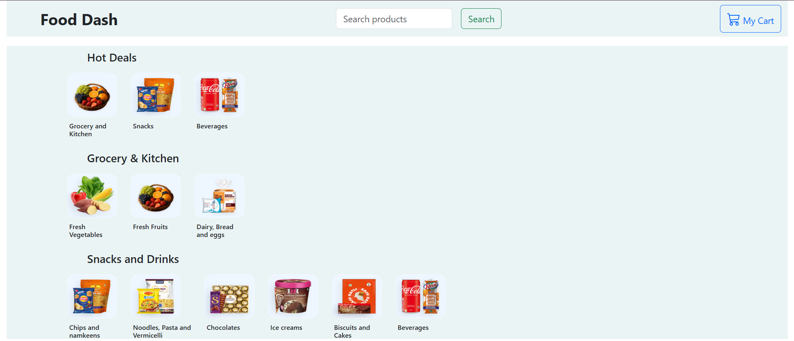

### Login Page
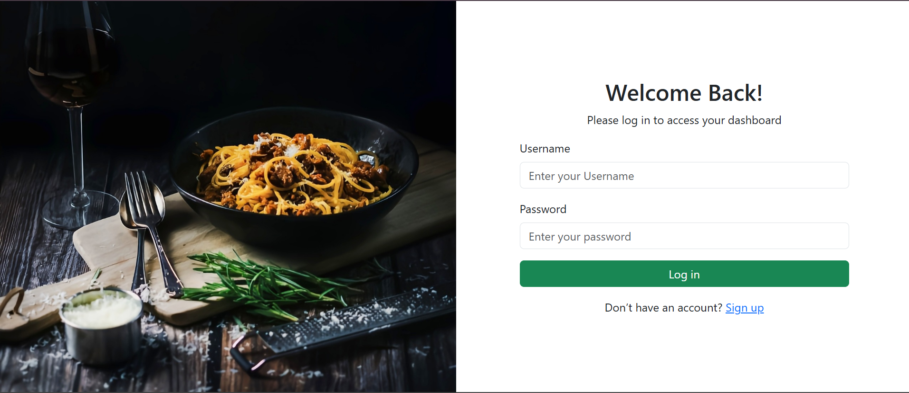

### Signup Page
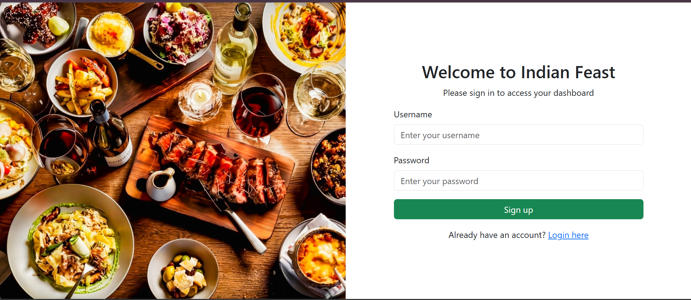

---

## Product Categories

### Grocery & Kitchen
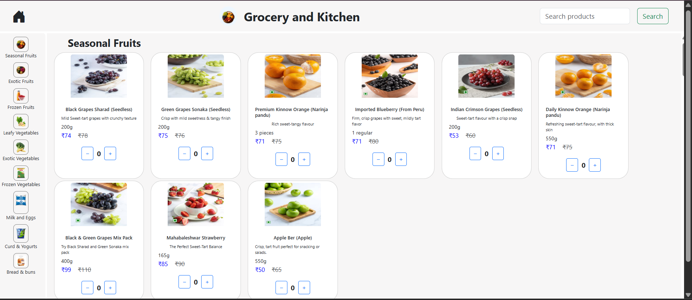

### Snacks
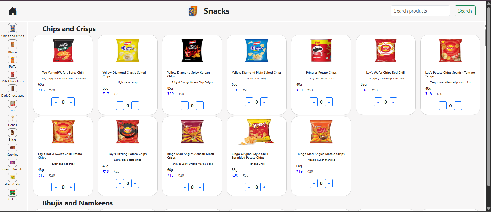

### Beverages
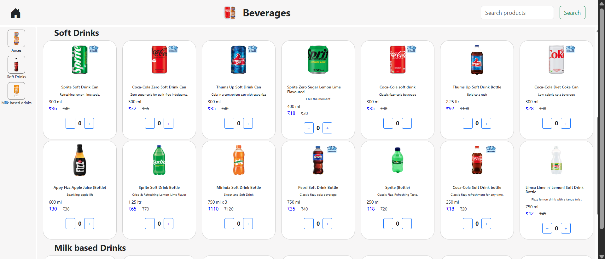

### Fresh Vegetables
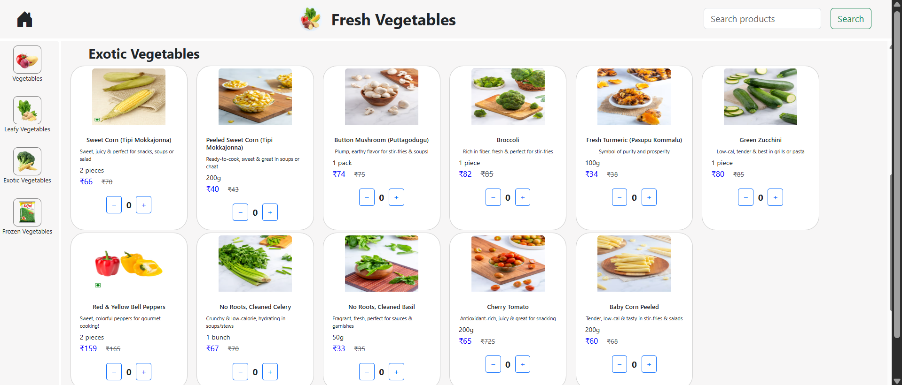

### Fresh Fruits
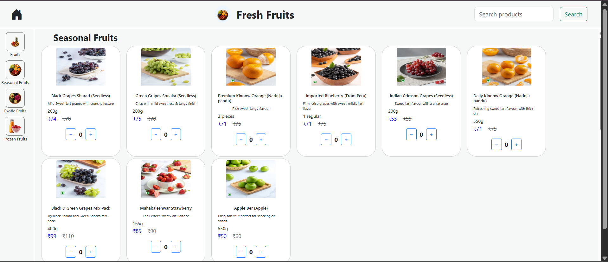

### Bread & Eggs
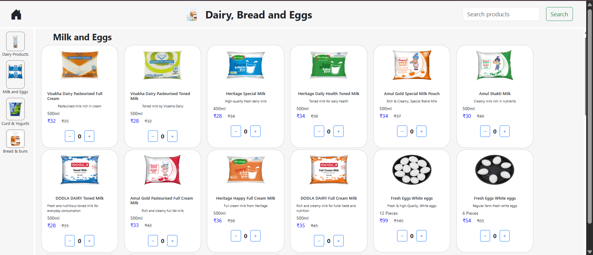

### Pasta & Noodles
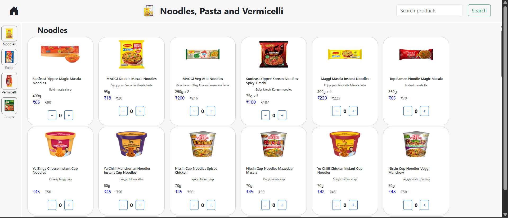

### Chocolates
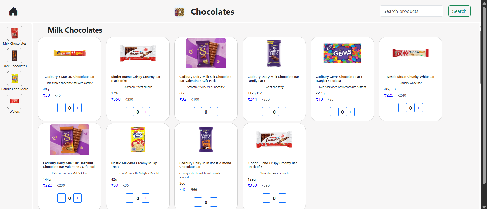

### Ice Creams
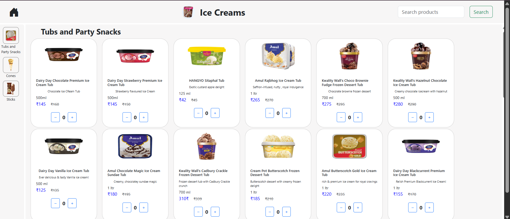

### Biscuits & Cakes
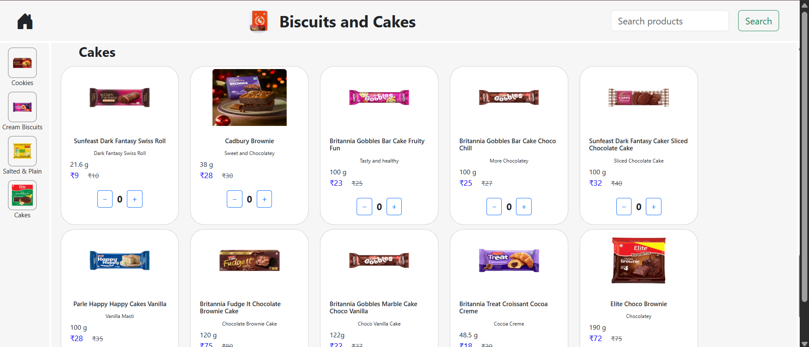

---

### Cart Page
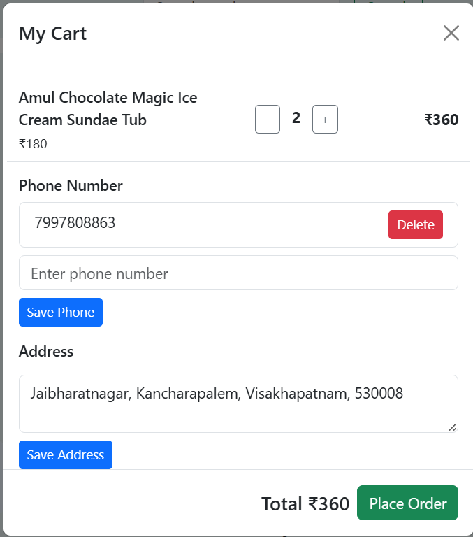

---

## How to Run Locally

1. Install XAMPP  
2. Start Apache & MySQL  
3. Place project folder inside `htdocs`  
4. Import database into phpMyAdmin  
5. Open browser:  
   ```
   http://localhost/Mini-Ecommerce_Project
   ```

---